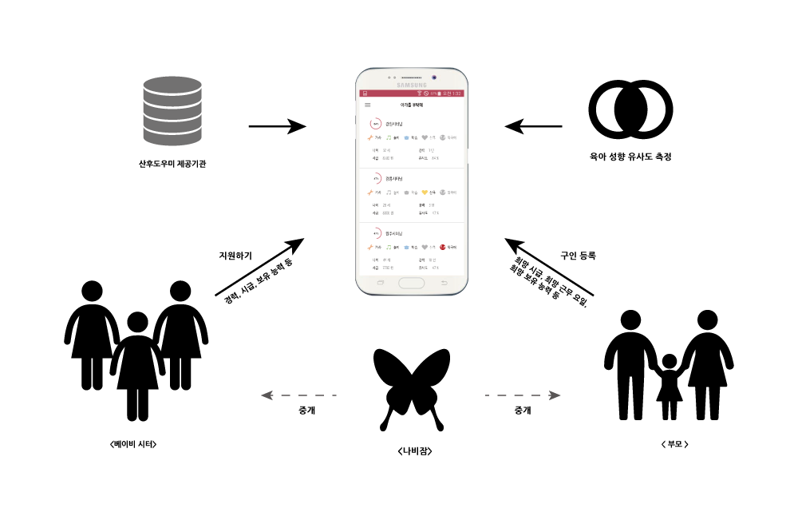
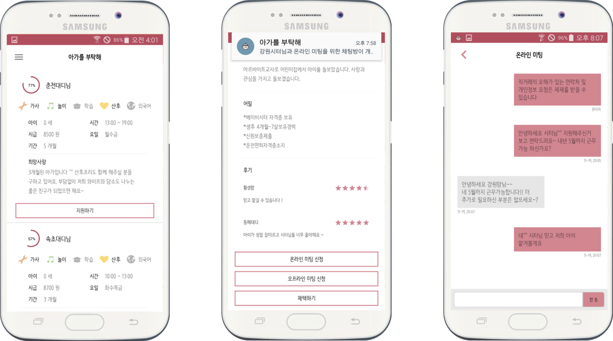

### 유사도 기반 베이비시터 매칭 서비스 개발 

- 2017 강원 데이터 창업 앱 개발 공모전 우수상 수상작, 2017.09 ~ 2017.12 

- Overview 

  - 양육 유사도 기반 베이비시터 매칭 서비스 개발
  - 역 경매 방식으로 베이비시터에 대한 정보를 비교하고 채택할 수 있는 매칭 서비스 개발
  - 양육 유사도 검사 기능을 통해  부모와 가장 유사한 양육 성향을 가진 베이비시터 추천              

- Contribution

  - Google Fire Base를 이용한 온라인 채팅 기능 구현
  - 데이터 베이스 및 서버 기능 개발                

- Service Architecture & Application UI		

  

  

- Used Skills 
  #Android #Google Fire Base #PHP #MySql